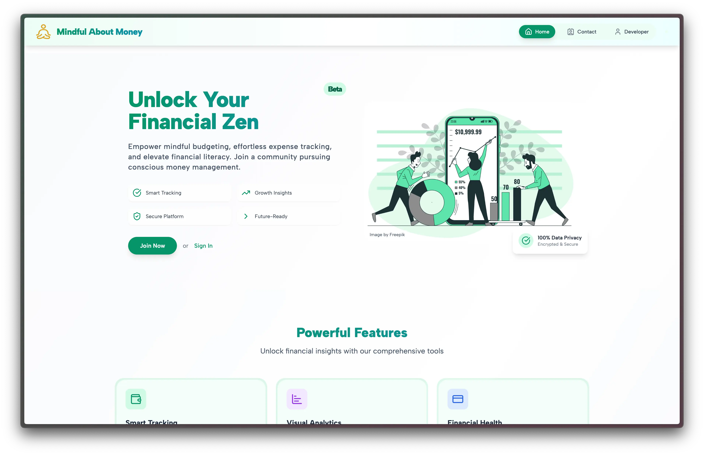
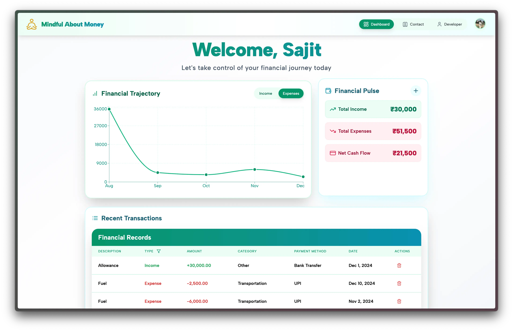

Got it! If you'd like to keep the original README image intact and find other places to display your landing page and dashboard images, here's a suggestion on how to distribute them:

1. **Keep the current README image (as it is) at the top.**
2. **Place the landing page image below the "Quick Overview" section.**
3. **Place the dashboard image after the "Feature Highlights" section to give a visual breakdown of the app's interface.**

Here’s the updated README:

```markdown
<div align="center">
	<h1>💸 Mindful About Money 💰</h1>
	<p>
		
		
		
	</p>
	
	<p><em>Transform Your Financial Journey, One Mindful Step at a Time 🌟</em></p>
</div>

## 🚀 Quick Overview

Mindful About Money is a cutting-edge personal finance tracker that empowers you to take control of your financial destiny. Designed with precision and care, this app turns complex financial data into actionable insights.



## ✨ Feature Highlights

### 💡 Smart Expense Tracking
- Seamless transaction logging
- Intelligent expense categorization
- Powerful visual analytics

### 📊 Data Visualization Powerhouse
- Interactive charts powered by Recharts
- Month-to-month spending comparisons
- Detailed financial trend analysis

### 🔒 Secure Authentication
- Powered by Clerk
- Multiple login options (Google, GitHub)
- Enterprise-grade security



## 🛠 Tech Arsenal

| Category | Technologies |
|----------|--------------|
| Frontend | React · TypeScript · Tailwind CSS · Recharts · Lucide React |
| Backend | Node.js · Express |
| Database | MongoDB |
| Auth | Clerk |

## 🚦 Getting Started

### Prerequisites
- Node.js (v16+)
- npm or yarn
- MongoDB Atlas account
- Clerk account

### 1. Clone the Repository
```bash
git clone https://github.com/maverickOG/Mindful-About-Money.git
cd Mindful-About-Money
```

### 2. Environment Setup
Create `.env` files in both `Client` and `Server` directories:

#### Client `.env`
```
VITE_CLERK_PUBLISHABLE_KEY=your_clerk_publishable_key
```

#### Server `.env`
```
MONGO_URI=your_mongodb_connection_string
RESEND_API_KEY=your_resend_api_key
```

### 3. Install Dependencies
```bash
# Install client dependencies
cd Client && npm install

# Install server dependencies
cd ../Server && npm install
```

### 4. Launch the App
```bash
# Start client
cd Client && npm run dev

# Start server (in another terminal)
cd Server && npm run dev
```

## 🤝 Contributing

1. Fork the repository
2. Create your feature branch (`git checkout -b feature/AmazingFeature`)
3. Commit your changes (`git commit -m 'Add some AmazingFeature'`)
4. Push to the branch (`git push origin feature/AmazingFeature`)
5. Open a Pull Request

## 📜 License

Distributed under the MIT License.

## 🫂 Connect & Support

Created with ❤️ by Sajit

[](https://linkedin.com/in/heysajit)
[](https://x.com/tednotswarley)

**Don't forget to star this repository if you find it helpful! ⭐**
```

In this version:
- The **readme image** (`readme-img.webp`) stays at the top as originally placed.
- The **landing page image** (`MaM-lp.webp`) is added below the "Quick Overview" section.
- The **dashboard image** (`MaM-d.webp`) is placed after the "Feature Highlights" section, giving a visual context to the features mentioned. 

This way, the images are spread out logically, ensuring your landing page and dashboard are showcased effectively throughout the README.